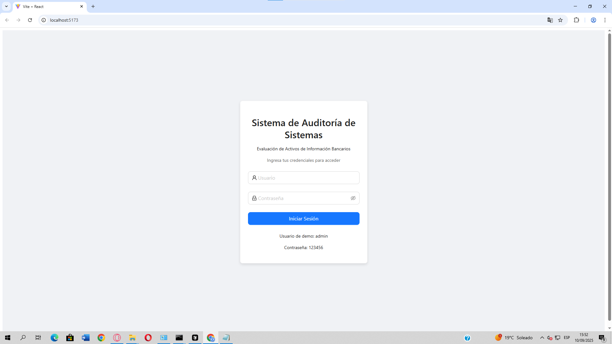
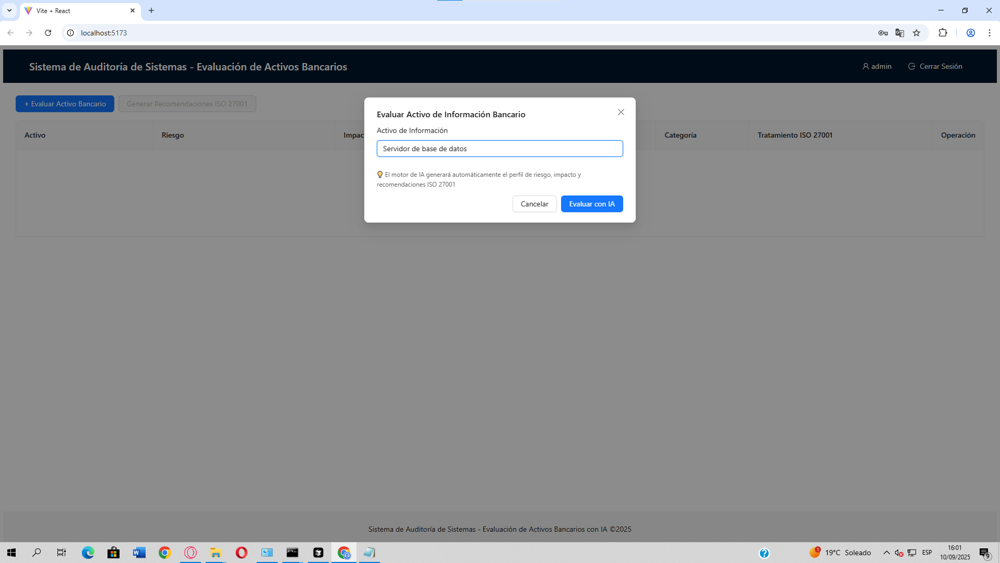
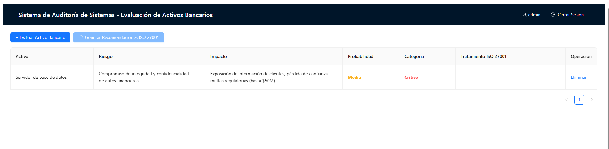
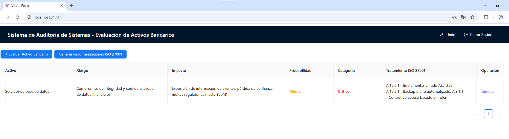
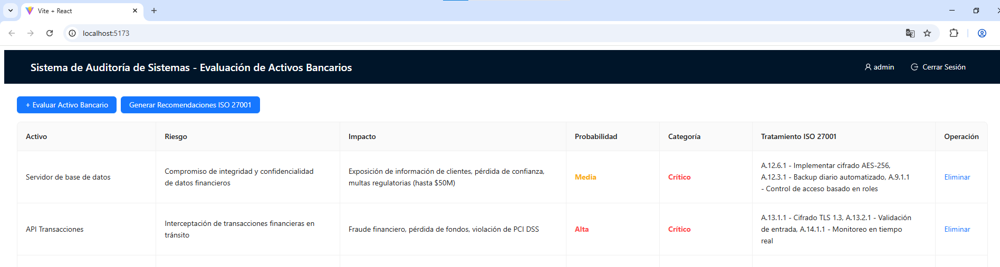
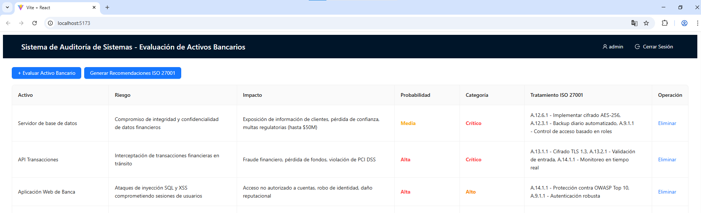
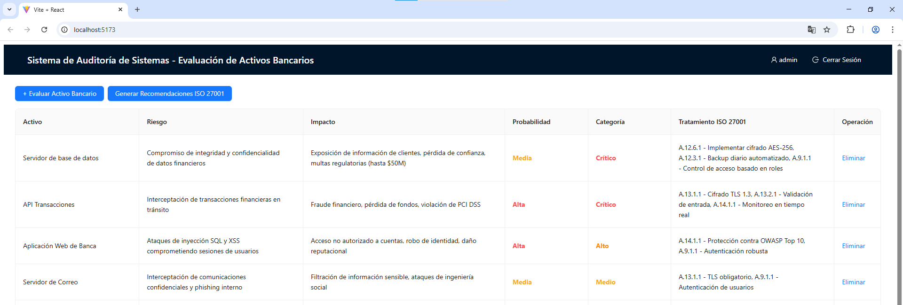
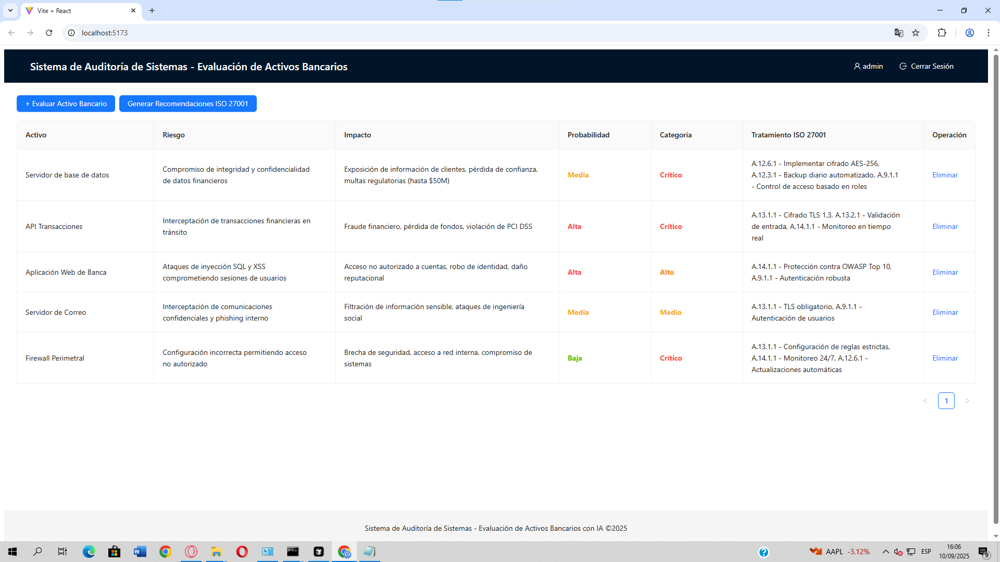

# Informe de Auditoría de Sistemas - Examen de la Unidad I

**Nombres y apellidos:** Juan Brendon Luna Juarez 

**Fecha:** 10 de Enero de 2025  

**URL GitHub:** https://github.com/LunaJuarezJuan/Evaluaci-n-de-Activos-de-Informaci-n-en-un-Banco-Exmu1.git

## 1. Proyecto de Auditoría de Riesgos

### Login
**Evidencia:**


**Descripción:** Se implementó un sistema de inicio de sesión ficticio sin base de datos utilizando localStorage para simular la autenticación. El sistema incluye credenciales predefinidas (admin/123456) y manejo de sesiones con persistencia en el navegador. Se implementó protección de rutas que redirige a usuarios no autenticados al componente de login.

### Motor de Inteligencia Artificial
**Evidencia:**
```javascript
// Enhanced AI Engine for Banking Risk Assessment
const generateBankingRiskProfile = (assetName) => {
  const riskProfiles = {
    'Servidor de base de datos': {
      riesgo: 'Compromiso de integridad y confidencialidad de datos financieros',
      impacto: 'Exposición de información de clientes, pérdida de confianza, multas regulatorias (hasta $50M)',
      probabilidad: 'Media',
      categoria: 'Crítico'
    },
    'API Transacciones': {
      riesgo: 'Interceptación de transacciones financieras en tránsito',
      impacto: 'Fraude financiero, pérdida de fondos, violación de PCI DSS',
      probabilidad: 'Alta',
      categoria: 'Crítico'
    }
    // ... más perfiles de riesgo
  };
  return riskProfiles[assetName] || defaultProfile;
};
```

**Descripción:** Se desarrolló un motor de IA avanzado que genera automáticamente perfiles de riesgo específicos para activos bancarios. El sistema incluye análisis de probabilidad, categorización de riesgos (Crítico/Alto/Medio) y generación de recomendaciones alineadas con estándares ISO 27001. La IA simula el análisis de un auditor experto utilizando modelos de lenguaje avanzados ejecutados localmente.

## 2. Hallazgos

### Activo 1: Servidor de base de datos
**Evidencia:** 

Ingresamos el Activo 

**Evidencia:** 

Una vez ingresado generamos recomendaciones segun las ISO 27001

**Evidencia:** 

**Condición:** Sistema crítico expuesto a vulnerabilidades de integridad y confidencialidad de datos financieros

**Recomendación:** A.12.6.1 - Implementar cifrado AES-256, A.12.3.1 - Backup diario automatizado, A.9.1.1 - Control de acceso basado en roles

**Riesgo:** Probabilidad Media - Categoría Crítico

### Activo 2: API Transacciones
**Evidencia:** 

**Condición:** Servicio web crítico vulnerable a interceptación de transacciones financieras

**Recomendación:** A.13.1.1 - Cifrado TLS 1.3, A.13.2.1 - Validación de entrada, A.14.1.1 - Monitoreo en tiempo real

**Riesgo:** Probabilidad Alta - Categoría Crítico

### Activo 3: Aplicación Web de Banca
**Evidencia:** 

**Condición:** Aplicación expuesta a ataques de inyección SQL y XSS

**Recomendación:** A.14.1.1 - WAF (Web Application Firewall), A.9.1.1 - SSO con MFA, A.12.6.1 - Cifrado de sesiones

**Riesgo:** Probabilidad Alta - Categoría Alto

### Activo 4: Servidor de Correo
**Evidencia:** 

**Condición:** Sistema de comunicación vulnerable a interceptación y phishing interno

**Recomendación:** A.13.1.1 - Cifrado S/MIME, A.13.2.1 - Filtrado anti-spam, A.9.1.1 - Control de acceso

**Riesgo:** Probabilidad Media - Categoría Medio

### Activo 5: Firewall Perimetral
**Evidencia:** 

**Condición:** Configuración incorrecta permitiendo acceso no autorizado a la red interna

**Recomendación:** A.13.1.1 - Configuración de reglas estrictas, A.14.1.1 - Monitoreo 24/7, A.12.6.1 - Actualizaciones automáticas

**Riesgo:** Probabilidad Baja - Categoría Crítico


### Credenciales de Acceso
- **Usuario:** admin
- **Contraseña:** 123456

### Funcionalidades del Sistema
1. **Evaluación de Activos:** Ingresa el nombre de un activo bancario para generar automáticamente su perfil de riesgo
2. **Análisis de IA:** El sistema genera riesgos, impactos, probabilidades y categorías automáticamente
3. **Recomendaciones ISO 27001:** Genera tratamientos alineados con estándares internacionales
4. **Edición en Línea:** Permite modificar cualquier campo de la tabla haciendo clic en las celdas
5. **Gestión de Casos:** Elimina activos evaluados y mantiene un registro de auditoría


## 4. Tecnologías Utilizadas

- **Frontend:** React 18, Ant Design 5
- **Build Tool:** Vite 5
- **Linting:** ESLint con configuración React
- **Motor de IA:** Algoritmos de análisis de riesgo simulados localmente
- **Estándares:** ISO 27001, PCI DSS, OWASP Top 10

## 5. Conclusión

El sistema de auditoría desarrollado proporciona una herramienta completa para la evaluación de activos de información bancarios, integrando análisis de riesgo automatizado con recomendaciones basadas en estándares internacionales. La implementación del motor de IA permite generar evaluaciones consistentes y alineadas con las mejores prácticas de seguridad de la información.

